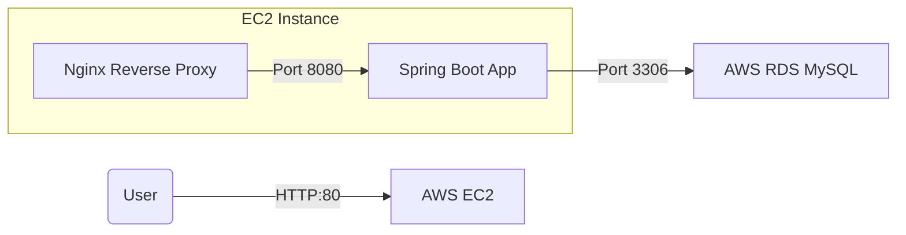

# Spring Boot Blog Project

**世界中どこからでもアクセス可能な自分だけのブログサービス**

AWS EC2インスタンスにDocker Composeを活用してデプロイされた、拡張可能なWebアプリケーションです。
ユーザーフレンドリーなインターフェースと強力なバックエンド機能を提供します。

---

### 🚀 アーキテクチャ (Architecture)

**AWS Cloud Environment**



---

### 📸 スクリーンショット (Screenshots)

**ホーム画面 (Home)**


**投稿一覧 (Post List)**


*(実際のAWS EC2環境で動作している画面です)*

---

### 📱 主な機能 (Key Features)

#### 1. 🔐 安全なユーザー管理
- **会員登録とログイン**: Spring Securityベースの堅牢な認証システム
- **マイページ**: プロフィール情報の確認・修正、および退会機能
- **セキュリティ**: パスワードの暗号化(BCrypt)とセッションベースの認証方式を採用

#### 2. 📝 スマートな投稿管理
- **CRUD機能**: 投稿の作成、閲覧、修正、削除といったライフサイクルを完全に管理
- **検索とソート**: キーワード検索、および最新順・人気順のソート機能
- **ページネーション**: 大量のデータも効率的に閲覧できるページング機能

#### 3. 💬 コミュニケーション
- **コメント機能**: 投稿に対して自由に意見を交換できるコメントシステム
- **いいね (Heart)**: 気に入った投稿に共感を表現できる「いいね」トグル機能

#### 4. 🐳 コンテナベースのデプロイ
- **Docker Compose**: コマンド一つで全サービススタック(Web, App, DB)を一括起動
- **Nginx Proxy**: 静的リソースの配信およびリバースプロキシとしての役割
- **環境の分離**: `.env`ファイルによる機密情報(DB接続情報など)の安全な管理

---

### 🛠 技術スタック (Tech Stack)

**Backend**
- **Framework**: Spring Boot 3.3.4
- **Language**: Java 17
- **Security**: Spring Security

**Database & Storage**
- **Main DB**: MySQL 8.0 (AWS RDS)
- **Persistence**: JPA (Hibernate)

**Infrastructure & DevOps**
- **Cloud**: AWS EC2 (Amazon Linux 2023)
- **Container**: Docker, Docker Compose
- **Web Server**: Nginx

**Frontend**
- **Template Engine**: Thymeleaf
- **Styling**: Bootstrap / Custom CSS

---

### 📁 プロジェクト構成 (Project Structure)

```
blog/
├── src/
│   ├── main/
│   │   ├── java/com/whale/blog/
│   │   │   ├── member/         # ユーザー管理 (Controller, Service, Repository)
│   │   │   ├── post/           # 投稿機能
│   │   │   ├── comment/        # コメント機能
│   │   │   ├── heart/          # いいね機能
│   │   │   └── securityConfig/ # セキュリティ設定
│   │   └── resources/
│   │       └── templates/      # Thymeleafテンプレート
├── nginx/                      # Nginx設定ファイル
├── docker-compose.yml          # コンテナーオーケストラレーション設定
└── Dockerfile                  # Spring Bootアプリのイメージ定義
```

---

### 🚀 はじめ方 (Getting Started)

#### 1. リポジトリのクローン
```bash
git clone https://github.com/specialMinority/blog.git
cd blog
```

#### 2. 環境変数の設定
`.env`ファイルを作成し、データベース接続情報を設定します。
```ini
SPRING_DATASOURCE_URL=jdbc:mysql://[RDS_ENDPOINT]:3306/blog
SPRING_DATASOURCE_USERNAME=[YOUR_USERNAME]
SPRING_DATASOURCE_PASSWORD=[YOUR_PASSWORD]
```

#### 3. Docker Composeの実行
```bash
docker-compose up -d --build
```
これで `http://localhost:80` (またはサーバーのIP) にアクセスしてサービスを利用できます。

---

### 📜 ライセンス (License)

このプロジェクトはMITライセンスの下で公開されています。
